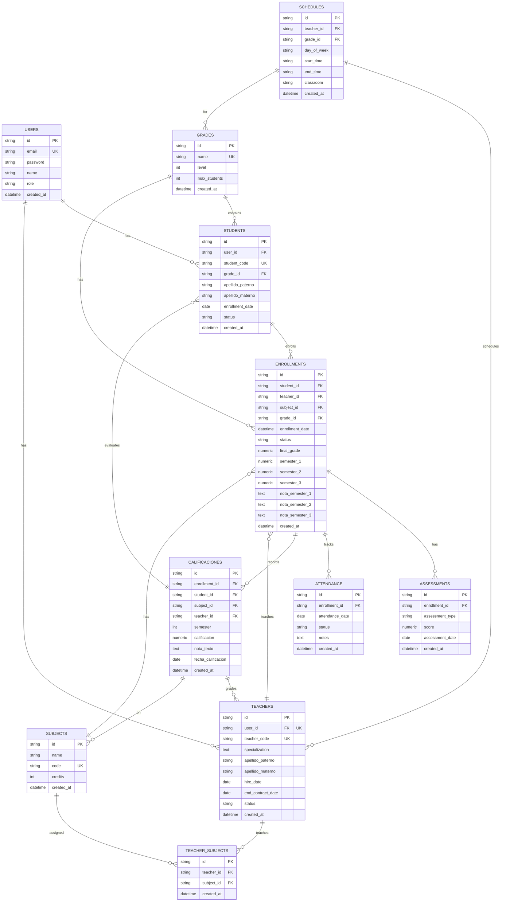

# Diagrama de Entidad-Relación - Sistema Gestión Académica Secundaria

## Diagrama ER en Mermaid



## Relaciones Principales

### 1️⃣ **USERS** (Centro de Autenticación)
- **1 User → Muchos Students** (Un usuario puede ser estudiante)
- **1 User → 1 Teacher** (Un usuario puede ser profesor)
- Roles: `admin`, `teacher`, `student`

### 2️⃣ **STUDENTS** (Estudiantes)
- **N Students → 1 Grade** (Muchos estudiantes en un grado)
- **1 Student → N Enrollments** (Un estudiante en muchas inscripciones)
- **1 Student → N Calificaciones** (Historial de calificaciones)

### 3️⃣ **TEACHERS** (Profesores)
- **1 Teacher → N Enrollments** (Un profesor enseña múltiples inscripciones)
- **1 Teacher → N Teacher_Subjects** (Un profesor enseña múltiples materias)
- **1 Teacher → N Schedules** (Un profesor tiene múltiples horarios)
- **1 Teacher → N Calificaciones** (Un profesor asigna múltiples calificaciones)

### 4️⃣ **ENROLLMENTS** (Inscripciones - Centro del Sistema)
- **N Enrollments → 1 Student**
- **N Enrollments → 1 Teacher**
- **N Enrollments → 1 Subject**
- **N Enrollments → 1 Grade**
- **1 Enrollment → N Assessments** (Múltiples evaluaciones)
- **1 Enrollment → N Attendance** (Registro de asistencia)
- **1 Enrollment → N Calificaciones** (Múltiples registros de calificaciones)

### 5️⃣ **GRADES** (Grados Escolares)
- **1 Grade → N Students** (1° a 6° Primaria)
- **1 Grade → N Enrollments**
- **1 Grade → N Schedules**

### 6️⃣ **SUBJECTS** (Materias)
- **1 Subject → N Enrollments**
- **1 Subject → N Teacher_Subjects**
- **1 Subject → N Calificaciones**

### 7️⃣ **TEACHER_SUBJECTS** (Relación M:M)
- Asocia Teachers con Subjects
- Indica qué materias enseña cada profesor

### 8️⃣ **SCHEDULES** (Horarios)
- Vincula Teacher con Grade y horario
- day_of_week, start_time, end_time, classroom

### 9️⃣ **ASSESSMENTS** (Evaluaciones)
- Registra evaluaciones específicas por Enrollment
- assessment_type, score, assessment_date

### 🔟 **ATTENDANCE** (Asistencia)
- Registra asistencia diaria por Enrollment
- status: presente, ausente, justificado

### 1️⃣1️⃣ **CALIFICACIONES** (Calificaciones Detalladas)
- Registro individual de calificaciones por semestre
- Sincronizado con Enrollment (semester_1, semester_2, semester_3)
- student_id, subject_id, teacher_id, semester, calificacion

---

## Flujo de Datos Principal

```
LOGIN (Usuario)
   ↓
DASHBOARD (Según rol: admin/teacher/student)
   ↓
┌─────────────────────────────────────────────┐
│                                             │
├─ ADMIN                                      │
│  ├→ Gestionar STUDENTS                     │
│  ├→ Gestionar TEACHERS                     │
│  ├→ Ver GRADES                             │
│  ├→ Ver ENROLLMENTS                        │
│  ├→ Gestionar CALIFICACIONES               │
│  └→ Ver CREDENCIALES                       │
│                                             │
├─ TEACHER                                    │
│  ├→ Ver mis ENROLLMENTS                    │
│  ├→ Registrar CALIFICACIONES               │
│  ├→ Registrar ATTENDANCE                   │
│  └→ Ver SCHEDULES                          │
│                                             │
└─ STUDENT                                    │
   ├→ Ver mis ENROLLMENTS                    │
   ├→ Ver mis CALIFICACIONES                 │
   └→ Ver mis COURSES                        │
```

---

## Cardinalidad de Relaciones

| Relación | Tipo | Descripción |
|----------|------|------------|
| User → Student | 1:N | Un usuario puede ser estudiante (o no) |
| User → Teacher | 1:1 | Un usuario es profesor (máximo 1) |
| Grade → Student | 1:N | Un grado contiene muchos estudiantes |
| Grade → Enrollment | 1:N | Un grado tiene muchas inscripciones |
| Teacher → Enrollment | 1:N | Un profesor enseña múltiples inscripciones |
| Student → Enrollment | 1:N | Un estudiante tiene múltiples inscripciones |
| Subject → Enrollment | 1:N | Una materia en múltiples inscripciones |
| Teacher ⟷ Subject | N:M | Profesores enseñan múltiples materias (via Teacher_Subjects) |
| Enrollment → Assessment | 1:N | Una inscripción tiene múltiples evaluaciones |
| Enrollment → Attendance | 1:N | Una inscripción tiene múltiples registros de asistencia |
| Enrollment → Calificacion | 1:N | Una inscripción tiene múltiples calificaciones |
| Calificacion → Student | N:1 | Múltiples calificaciones para un estudiante |
| Calificacion → Teacher | N:1 | Un profesor asigna múltiples calificaciones |
| Schedule → Teacher | N:1 | Un profesor tiene múltiples horarios |
| Schedule → Grade | N:1 | Un grado tiene múltiples horarios |

---

## Claves Principales

✅ **Primary Keys (PK):** Todos usan UUID (string de 36 caracteres)
✅ **Foreign Keys (FK):** Apuntan a las tablas relacionadas
✅ **Unique Keys (UK):** email, student_code, teacher_code, subject_code, grade_name

